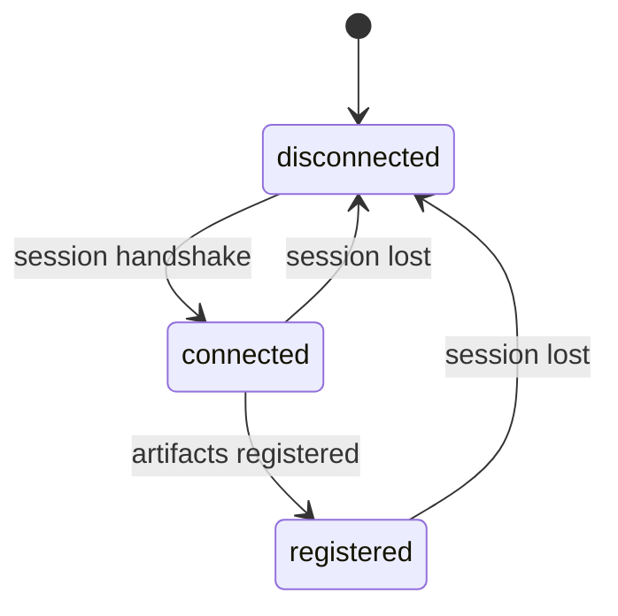

A Chronicle client is a small supervision tree of processes that all depend on one live connection to the kernel. Reactors, reducers, projections, seeders, webhooks and subscriptions all need that connection, and they all need it to come *back* after it drops. Instead of letting each of them retry on its own, which races and registers observers before the kernel knows their definitions, the client drives every part through one connection lifecycle. The design follows the .NET client's connection lifecycle.

This page explains that lifecycle and, more importantly for your code, what calls return while it is not ready.

## The three phases

| Phase | Meaning |
|-------|---------|
| `:disconnected` | No live session with the kernel. |
| `:connected` | The session handshake completed: the kernel acknowledged the client's connection id with its first keepalive. The channel can carry calls. |
| `:registered` | The client has registered the event store, namespace, event types, constraints, read models and projections. Observers may now attach, and seeders run. |

Splitting `:connected` from `:registered` keeps observers from racing ahead of their server-side definitions. A reducer's observation stream can't be registered until the kernel knows about the reducer's read model, so reactors and reducers wait for `:registered`, never merely `:connected`.



## Wait for readiness in your code

`Chronicle.Client` starts, and returns from `Supervisor.start_link/2`, long before the lifecycle reaches `:registered`. What a call does in that window depends on the call:

- Appends, event log reads and most other calls use the gRPC channel as soon as it exists. Before that, and while the client reconnects, they return `{:error, :not_connected}` instead of waiting. Once the channel is up they are sent even if registration hasn't finished, so an append can reach the kernel before your event types are registered.
- Read model queries in `Chronicle.ReadModels`, including `Chronicle.read_model/3`, first wait up to 30 seconds for `:registered`, then retry briefly while the kernel settles.

Block until the client is ready with `Chronicle.Connections.Lifecycle.wait_until/3`:

```elixir
alias Chronicle.Connections.Lifecycle

case Lifecycle.wait_until(Lifecycle.name_for(Chronicle.Client), :registered, 30_000) do
  :ok -> :ready
  {:error, :timeout} -> :not_ready
end
```

`Lifecycle.name_for/1` takes the client's `name:`, which defaults to `Chronicle.Client`. To follow phase changes instead of blocking, call `Lifecycle.subscribe/1`. It returns `{:ok, phase, connection_id}` with the current phase and then sends `{:chronicle_lifecycle, phase, connection_id}` messages on every transition. `Lifecycle.phase/1` returns the current phase.

## What happens on connect

On every connect, first or not, the client runs the same ordered registration:

1. Ensure the event store and namespace exist.
2. Register event types, including their migrations.
3. Register constraints.
4. Register read models.
5. Register projections, including the read-model definitions of reducers.
6. Advance to `:registered`.
7. Reactors and reducers open their observation streams, webhook and subscription registrars register, and seeders run.

Steps 1 to 5 finish before step 7, so observers never register against definitions that don't exist yet. If any registration step fails, the client logs `Chronicle registration failed` with the reason, stays in `:connected`, and retries every five seconds. A registration that never succeeds, such as a rejected event type schema, therefore shows up as a client that never reaches `:registered`. Check the log for that message.

## What happens on disconnect

The kernel sends the client a keepalive every second, and the client answers each one. When no keepalive arrives for five seconds, or the session stream ends, the client treats the session as dead:

1. The lifecycle moves to `:disconnected`.
2. Reactors and reducers close their observation streams and wait.
3. The connection id is rotated, so the next session uses a fresh identity.
4. The client dials a fresh channel and runs the connect sequence above again.

The channel reconnects with exponential backoff, starting at one second and capped at ten. Tune it with the `:reconnect_base_delay` and `:reconnect_max_delay` client options, in milliseconds. The client keeps retrying for as long as it runs.

The `:retry_attempts` option is accepted for backward compatibility and ignored; reconnection doesn't give up.

Reactors register as replayable, and projections and reducers are rewindable. When an observer re-attaches, Chronicle resumes it from the last event it handled, so events appended while it was detached are delivered then, not skipped.

## Calls during an outage

Appends and queries are not queued or retried while the client is disconnected. Treat them like any other remote call:

- Expect `{:error, :not_connected}` while the client has no channel, and decide whether to retry, fail the request, or wait with `Lifecycle.wait_until/3`.
- A call that races a dying channel returns `{:error, %GRPC.RPCError{status: 14}}` (unavailable). A reply the gRPC transport can't read, such as the kernel rejecting an unauthenticated call, returns `{:error, %GRPC.RPCError{status: 13}}`. Version 3.5.0 raised or exited in the caller in both cases.
- A successful `:ok` means Chronicle stored the event. An error from a call that timed out doesn't prove the write failed; see [Event sequences](../event-sequences.md#appending-and-waiting-for-observer-completion).

## Seeding waits for registration

Seeders run each time the lifecycle reaches `:registered`: at startup and again after every reconnect. A failed seeding run is retried every five seconds. Seeding skips event sources that already have events, so running it again after a reconnect appends nothing new. See [Seeding](../seeding.md#how-it-runs).

## Failure isolation

Each reactor and reducer manages its own observation stream. If one stream fails while the connection is healthy, only that stream reopens, after a short delay. A failing observer never takes down the connection or its siblings. Failures inside your handlers are reported to Chronicle as [failed partitions](../failed-partitions.md).

## What you manage

You don't write reconnect code. The client re-establishes the session, re-registers artifacts and re-attaches observers on its own. What you do own is how your code behaves while the client is not `:registered`: wait for readiness before the first call, and handle `{:error, reason}` from every call.
